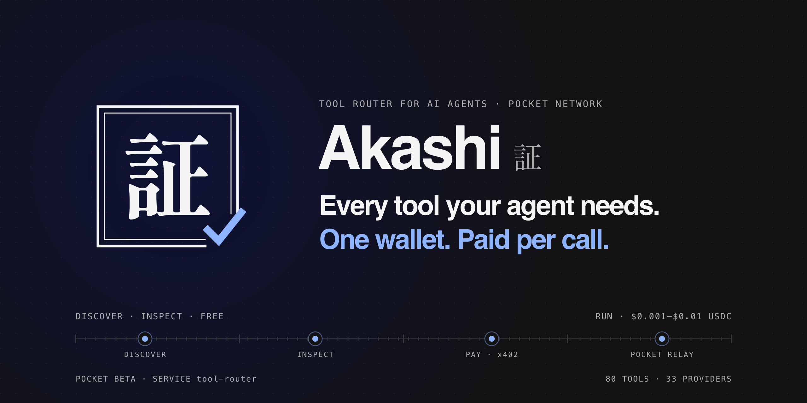
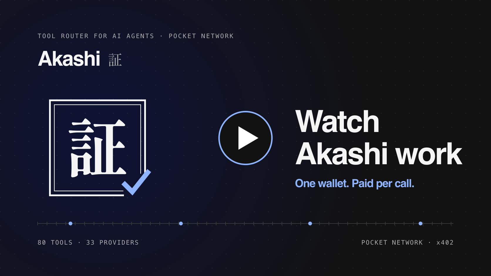
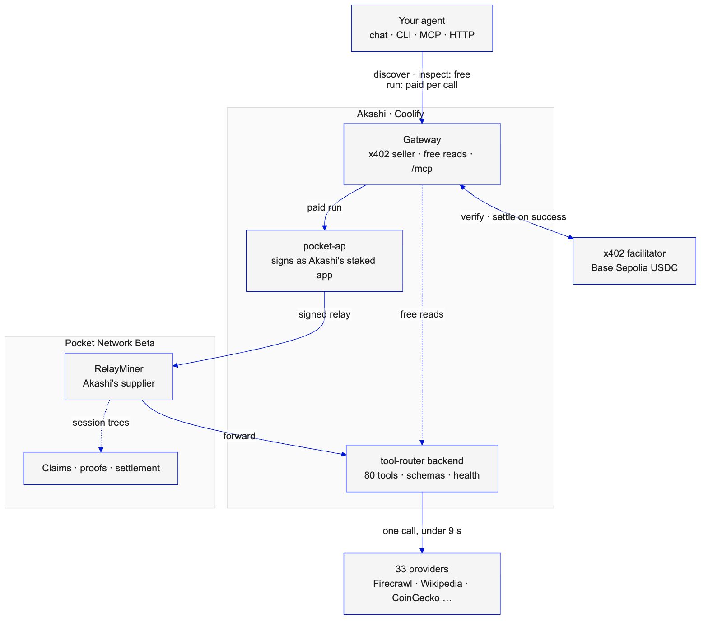
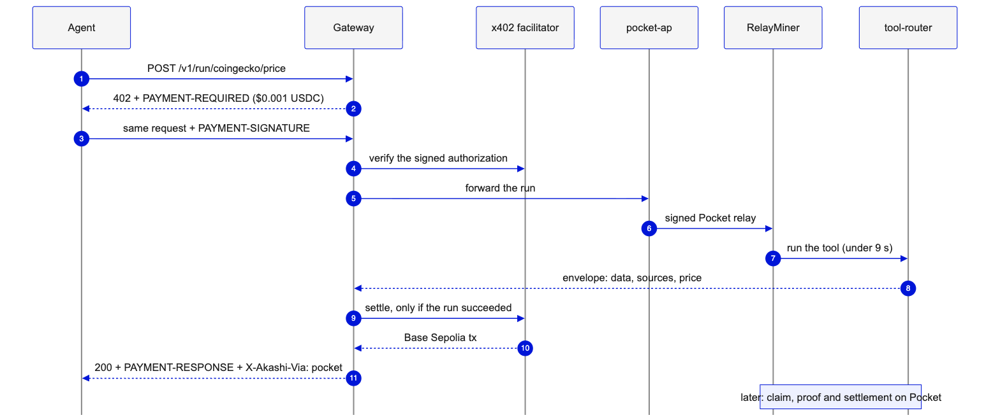

<p align="center">
  <a href="https://useakashi.xyz">
    <picture>
      <source media="(prefers-color-scheme: dark)" srcset=".github/assets/banner-dark.png" />
      <source media="(prefers-color-scheme: light)" srcset=".github/assets/banner-light.png" />
      
    </picture>
  </a>
</p>

<h1 align="center">Akashi · 証</h1>
<p align="center">One place where an AI agent finds a tool, pays a fraction of a cent for it, and gets the answer.<br/>80 tools from 33 providers, paid per call in USDC over x402, with the paid runs travelling as Pocket Network relays.</p>

<p align="center">
  <a href="https://useakashi.xyz"><b>Open the app</b></a>
  &nbsp;·&nbsp;
  <a href="#demo-video"><b>Demo video</b></a>
  &nbsp;·&nbsp;
  <a href="https://useakashi.xyz/agent"><b>Try the agent</b></a>
  &nbsp;·&nbsp;
  <a href="https://explorer.pocket.network/beta/service/tool-router"><b>tool-router on Pocket</b></a>
  &nbsp;·&nbsp;
  <a href="https://mcp.pocketmcp.network/audit?network=beta&ids=tool-router&operator=pokt1qnrjr3susgpyh4a4rx8f0x0wd6pqdtptr50ayg"><b>Service Audit</b></a>
  &nbsp;·&nbsp;
  <a href="https://docs.useakashi.xyz"><b>Docs</b></a>
</p>

Built for the **Pocket Network Agentic Services Hackathon**. Jump to [how Akashi meets the hackathon](#how-akashi-meets-the-hackathon).

*Akashi* (証) means proof. Every paid run comes back with a receipt you can check: the USDC transfer on Base Sepolia, and the relay that Pocket Network claimed and settled.

## The idea

An agent in the middle of a task needs live data: the weather in Lagos, the latest release of a library, three recent papers on a topic, a bitcoin price, what a web page says. Each of those usually means a different vendor, a signup, an API key and a monthly plan, and an agent cannot do any of that on its own.

Akashi puts the tools behind one API and one way to pay. The agent **discovers** a tool for its job and **inspects** its input schema, both free, then **runs** it and pays that tool's price for that one call. No account and no API key: the payment is the credential. A run that errors, or looks up something that does not exist, is not charged.

**In practice.** Asked "Is it raining in Lagos right now, and what is 100 USD in naira?", the agent in Akashi's chat picks `openweather/current` and `frankfurter/rates`, pays $0.005 and $0.001, and answers. Under the answer are the two tool cards, the two receipts with their Base Sepolia transactions, and "Pocket relay · tool-router".

## Demo video

<p align="center">
  <a href="https://useakashi.xyz/demo">
    
  </a>
</p>

**[Watch it on /demo](https://useakashi.xyz/demo)**, with the same steps to repeat live.

You can also follow the proof directly:

1. Open [the agent](https://useakashi.xyz/agent) and ask anything that needs live data. Demo credit pays, so no wallet is needed.
2. Open the first relayed paid run on Basescan: [`0xb544a3a4…a32b`](https://sepolia.basescan.org/tx/0xb544a3a445ed90c0a4d23794c63f6524723ea986628f5abac15b286c63c0a32b), 0.001 USDC from the payer to Akashi, settled after the tool answered.
3. Open the Pocket claim for that relay, [`AC215AB4…E244`](https://explorer.pocket.network/beta/tx/AC215AB4282193BDE42DD2EA99E419C0E489F17594371D64988A89F3F9A3E244), and its proof, [`6729C253…6560`](https://explorer.pocket.network/beta/tx/6729C253844DF7CF7FEF9BDBD169F09D517067F2C09BF945D7659A4703E06560).
4. Run the [Service Audit](https://mcp.pocketmcp.network/audit?network=beta&ids=tool-router&operator=pokt1qnrjr3susgpyh4a4rx8f0x0wd6pqdtptr50ayg) for `tool-router`. It passes rules A1 to A9.

## How it works

1. **Discover.** `POST /v1/discover {"query": "weather in a city"}` ranks the catalog for the job: full-text search over agent-written descriptions with synonyms, tie-broken by each tool's measured health and its price ([`discover.py`](packages/tools/src/akashi_tools/framework/discover.py)). Free.
2. **Inspect.** `POST /v1/inspect {"id": "openweather/current"}` returns the tool's input and output JSON Schemas, price, notes and a working example. Free.
3. **Ask to run.** `POST /v1/run/openweather/current` without a payment answers `402`, with the exact price in the `PAYMENT-REQUIRED` header. Each tool has its own route and price, generated from the catalog, so no path can run unpaid ([`payments.ts`](services/gateway/src/payments.ts)).
4. **Bad input costs nothing.** Before asking for payment, the gateway checks the input against the tool's schema and answers `422` if it is wrong ([`server.ts`](services/gateway/src/server.ts)).
5. **Pay and relay.** The agent retries with a signed x402 payment, an EIP-3009 authorization for Base Sepolia USDC. The gateway verifies it and forwards the run through `pocket-ap`, which signs it as a relay from Akashi's staked application to Akashi's own RelayMiner ([`relay.ts`](services/gateway/src/relay.ts)).
6. **Run the tool.** The backend validates the input, calls the provider within the tool's deadline, validates the output against its schema, trims long fields and returns one envelope: `data`, `sources`, `price`, `found` ([`engine.py`](packages/tools/src/akashi_tools/framework/engine.py)).
7. **Settle only on success.** The payment settles after a response under 400. An error is never settled, and a lookup for something that does not exist comes back `billable: false` and unsettled. Settlements are queued one at a time with a retry, because the public facilitator's relayer otherwise collides with itself on parallel payments ([`serial-facilitator.ts`](services/gateway/src/serial-facilitator.ts)).
8. **Receipt.** The response carries the settlement in `PAYMENT-RESPONSE` and the path in `X-Akashi-Via`: `pocket` for a relay, or `direct` if the relay layer was unreachable and the gateway called the backend itself. A receipt never claims a relay that did not happen.
9. **Pocket settles.** The RelayMiner builds each session's tree, submits a claim and a proof, and the claim settles on Pocket Beta.

## Architecture

<p align="center">
  <picture>
    <source media="(prefers-color-scheme: dark)" srcset=".github/assets/system-dark.png" />
    <source media="(prefers-color-scheme: light)" srcset=".github/assets/system-light.png" />
    
  </picture>
</p>

[Edit the Mermaid source](.github/diagrams/readme-system.mmd)

**One paid run, start to finish:**

<p align="center">
  <picture>
    <source media="(prefers-color-scheme: dark)" srcset=".github/assets/paid-run-dark.png" />
    <source media="(prefers-color-scheme: light)" srcset=".github/assets/paid-run-light.png" />
    
  </picture>
</p>

[Edit the Mermaid source](.github/diagrams/readme-paid-run.mmd)

The gateway holds no Pocket key: `pocket-ap` signs relays with the application key, in its own container. The provider keys live only in the backend's server environment. A tool whose key is missing is listed as unavailable and never half-run. The backend has no public address: only the gateway and the RelayMiner reach it.

## The tools

80 tools from 33 providers in 18 categories. Each has a price, input and output schemas and a working example. The ones that need no key are run every 10 minutes, so the catalog shows measured health.

| Area | Tools |
| --- | --- |
| Web search and reading | Google search, images and places (Serper), Firecrawl search, scrape, site map and ask-a-page, Jina search and reader, Wayback Machine, YouTube video info |
| AI answers and text | `akashi/answer` (searches, reads the top pages and writes a cited answer), summarize, extract JSON, classify, translate (Groq) |
| Research | arXiv, OpenAlex, Crossref, Google Scholar, Firecrawl paper search, related papers and paper reader |
| Knowledge | Wikipedia, Wikidata, Open Library, current facts with sources |
| News | Google News search and headlines, Hacker News, Serper news, a merged GDELT and Hacker News feed |
| Weather and Earth | current weather, 5-day and 16-day forecasts, weather history since 1940, marine waves, air quality, earthquakes |
| Maps | OpenStreetMap geocoding and reverse geocoding, city lookup |
| Money and crypto | exchange rates cross-checked across central banks, converter, rate history, World Bank indicators, CoinGecko prices, top coins and trending, DefiLlama TVL |
| Developer | GitHub repos, search and releases, npm, PyPI, deps.dev versions and advisories, developer search |
| Time, science, words and more | time zones, holidays, business days, NASA, PubChem, Open Food Facts, dictionary, word finder, job boards, US law search, IP lookup |

Browse them at [/tools](https://useakashi.xyz/tools), or `GET /v1/catalog`. A new provider is one Python file per tool: [`CONNECTORS.md`](packages/tools/CONNECTORS.md).

## Connect an agent

| Way | How |
| --- | --- |
| **Skill** | Give the agent [`/SKILL.md`](https://useakashi.xyz/SKILL.md). It explains discover, inspect, run and the x402 flow. |
| **Remote MCP** | Add `https://api.useakashi.xyz/mcp` (Streamable HTTP): `akashi_discover`, `akashi_inspect`, `akashi_run`. Runs are paid by Akashi's demo wallet, capped per visitor per day ([`mcp.ts`](services/gateway/src/mcp.ts)). |
| **Local MCP and CLI** | `node akashi.mjs mcp` with your own `AKASHI_PRIVATE_KEY`: a stdio MCP server that pays from your key, with a per-call and a per-session cap ([`client.ts`](apps/cli/src/client.ts)). |
| **HTTP** | Any x402 client: `POST /v1/discover`, `POST /v1/inspect`, then `POST /v1/run/{provider}/{endpoint}`. |

The CLI is one file:

```bash
curl -fsSLO https://useakashi.xyz/akashi.mjs
node akashi.mjs discover "crypto prices"
node akashi.mjs inspect coingecko/price
AKASHI_PRIVATE_KEY=0x… node akashi.mjs run coingecko/price --input '{"coins": ["btc", "eth"]}'
```

The key needs Base Sepolia test USDC from [faucet.circle.com](https://faucet.circle.com), and no ETH.

## Built on

| Piece | What it does in Akashi | Where |
| --- | --- | --- |
| **Pocket Network (Shannon, Beta)** | One registered service, `tool-router`, at 20,000 compute units (800 uPOKT) per relay. Every tool is a path on it, so a new tool needs no new registration. | [`tool-router.card.json`](deploy/pocket/tool-router.card.json) |
| **HA RelayMiner** | Akashi's own supplier. The relayer checks each signed relay and forwards it to the backend; the miner builds session trees and submits claims and proofs. Redis 8.10 with `noeviction`. | [`deploy/pocket/compose.yaml`](deploy/pocket/compose.yaml) |
| **pocket-ap** | Signs every paid run as a relay from Akashi's staked application. | [`pocket-ap.yaml`](deploy/gateway/pocket-ap.yaml), [`relay.ts`](services/gateway/src/relay.ts) |
| **Pocket Service Builder** | Its MCP tools checked the service id was free, read the live fees and stakes, validated the card, watched sessions and claims, and run the Service Audit. `pocketd` registered the service and staked the supplier and the application. | [audit result](deploy/pocket/audits/2026-10-07-tool-router.json) |
| **x402** | `@x402/hono` sells each tool at its exact price with the `exact` scheme on Base Sepolia USDC, settled through the x402.org facilitator. `@x402/fetch` pays in the CLI and the chat. | [`payments.ts`](services/gateway/src/payments.ts), [`payRun.ts`](apps/web/src/features/wallet/payRun.ts) |
| **Model Context Protocol** | A remote server on the gateway and a local stdio server in the CLI, with the same three tools. | [`mcp.ts`](services/gateway/src/mcp.ts), [`apps/cli/src/mcp.ts`](apps/cli/src/mcp.ts) |
| **AI SDK 7** | The `/agent` chat: a tool loop with `find_tools`, `inspect_tool` and `run_tool`. In wallet mode `run_tool` has no server side: the browser shows a pay card, the wallet signs, and the result goes back to the model. | [`tools.server.ts`](apps/web/src/lib/agent/tools.server.ts), [`PayCard.tsx`](apps/web/src/features/agent/PayCard.tsx) |
| **RainbowKit and wagmi** | The wallet picker for paying from your own Base Sepolia wallet. The wallet signs only Base Sepolia USDC, to Akashi's address, at the price shown. | [`wagmi.ts`](apps/web/src/features/wallet/wagmi.ts) |
| **FastAPI and Python 3.13** | The connector framework: one `@tool` per endpoint with pydantic input and output models, deadlines, cache, health and the catalog. | [`packages/tools`](packages/tools) |
| **Coolify** | Hosts the backend, gateway, pocket-ap, RelayMiner, web and docs on one server; images build in GitHub Actions. | [`images.yml`](.github/workflows/images.yml) |

## How Akashi meets the hackathon

The hackathon asks for "a service that can be deployed on Pocket testnet and reached by an agent", useful to agents (data services, API wrappers, AI tools, research tools and more), and judges it on uniqueness, usefulness, technical complexity and market appeal.

| Requirement or criterion | How Akashi meets it | Check it here |
| --- | --- | --- |
| **Deployed on Pocket testnet** | `tool-router` is registered on Beta, with a staked supplier, a staked application and settled claims. | [service on the explorer](https://explorer.pocket.network/beta/service/tool-router) · [proof on Pocket Beta](#proof-on-pocket-beta) |
| **Reached by an agent** | The Skill, a remote MCP server, a local MCP server, the CLI and plain HTTP. The chat is itself an agent that uses Akashi. | [/agent](https://useakashi.xyz/agent) · [`mcp.ts`](services/gateway/src/mcp.ts) · [`SKILL.md`](https://useakashi.xyz/SKILL.md) |
| **Passes the Service Audit** | Rules A1 to A9 all `PASS` with no findings: registration, card, unique API, active supplier, https endpoint, TLS, a settled claim, probes and specs, and price (48th percentile of the 116 services on Beta). | [live audit](https://mcp.pocketmcp.network/audit?network=beta&ids=tool-router&operator=pokt1qnrjr3susgpyh4a4rx8f0x0wd6pqdtptr50ayg) · [saved result](deploy/pocket/audits/2026-10-07-tool-router.json) |
| **Follows the service rules** | Every response is a JSON object, errors included, with 4xx/5xx semantics. Inputs travel in the body. Request bodies are capped at 64 KiB, and each tool has a deadline under 9 seconds. | [`engine.py`](packages/tools/src/akashi_tools/framework/engine.py) · [`errors.py`](packages/tools/src/akashi_tools/framework/errors.py) |
| **Uniqueness** | Of the 116 services on Pocket Beta, none is a tool router. Akashi is a catalog an agent searches and pays per tool, not one more single-purpose wrapper. | [Pocket explorer services](https://explorer.pocket.network/beta/services) |
| **Usefulness** | The calls an agent makes many times per task (search, read a page, papers, packages, weather, prices, maps, time) behind one schema-checked contract and one way to pay. Errors and lookups that find nothing are free. | [/tools](https://useakashi.xyz/tools) · [`CONNECTORS.md`](packages/tools/CONNECTORS.md) |
| **Technical complexity** | An x402 seller with a route per tool, a free input check and settlement only on success; real Pocket relays through Akashi's own RelayMiner; a connector framework with schemas, deadlines, size limits, cache and measured health; search over the catalog; a chat with an inline wallet pay card. | [Architecture](#architecture) |
| **Market appeal** | Pay-per-call with no signup is the model an autonomous agent can use on its own. Prices run from $0.001 to $0.01, above each tool's upstream cost. On MainNet the service owner also earns Pocket's 2.5% data owner's fee on every relay. | [pricing](https://docs.useakashi.xyz/docs/pricing) |

## Proof on Pocket Beta

On Pocket Beta (`pocket-lego-testnet`) unless marked Base Sepolia, checked on 2026-10-07.

| Record | Transaction |
| --- | --- |
| Service `tool-router` registered | [`A96AAAB2…E67F7`](https://explorer.pocket.network/beta/tx/A96AAAB2B2BA81723ABB3C74BF10C7B79A7D55F07992D7F2F365B51D2AFE67F7) (height 711952) |
| Supplier staked, 60,000 POKT | [`E8997D51…4915`](https://explorer.pocket.network/beta/tx/E8997D51009D84EE42FFB9B69F0905C55AD4762ABD02F60645634784B97D4915) (height 712494) |
| Supplier moved to `relay.useakashi.xyz` | [`73D108E1…C2DD`](https://explorer.pocket.network/beta/tx/73D108E1EDF0E86E086C27178ADF0DD2F2F136E242915BA46007EA42B174C2DD) (active from height 714881) |
| Application staked | [`113EFC51…5BBC`](https://explorer.pocket.network/beta/tx/113EFC5118886B6F65EF23B2028F8ECCBAA6C0986BCC0E1E8E0CF5DE85835BBC), re-staked with headroom in [`9986F963…A316`](https://explorer.pocket.network/beta/tx/9986F9632F7D30D8C0499DB8A71B75C858E1D8A64DB80F5921B33579A666A316) |
| First x402-paid run relayed over Pocket (Base Sepolia) | [`0xb544a3a4…a32b`](https://sepolia.basescan.org/tx/0xb544a3a445ed90c0a4d23794c63f6524723ea986628f5abac15b286c63c0a32b) |
| Relay claim (MsgCreateClaim) | [`AC215AB4…E244`](https://explorer.pocket.network/beta/tx/AC215AB4282193BDE42DD2EA99E419C0E489F17594371D64988A89F3F9A3E244) (height 712535) |
| Proof (MsgSubmitProof) | [`6729C253…6560`](https://explorer.pocket.network/beta/tx/6729C253844DF7CF7FEF9BDBD169F09D517067F2C09BF945D7659A4703E06560) (height 712544) |
| Settled claims | 1, 12 and 5 relays in the first three sessions, 800 uPOKT per relay |

| Address | Role |
| --- | --- |
| `pokt16p53au7ctwrtfdwd23pt2tv54nj9f0n8wsj805` | Service owner |
| `pokt1qnrjr3susgpyh4a4rx8f0x0wd6pqdtptr50ayg` | Supplier operator |
| `pokt14d678cn7kzjy6zux5z7ekymz3dlnj3sgjme4mj` | Application that signs Akashi's relays |
| [`0x8164dabAfc824322221654ED421715FdaA66948D`](https://sepolia.basescan.org/address/0x8164dabAfc824322221654ED421715FdaA66948D) | Receives every x402 payment (Base Sepolia) |

Supplier endpoint: `https://relay.useakashi.xyz` (REST).

## Pricing and revenue

- **Per call, per tool.** $0.001 for keyless tools and Akashi's own computations, $0.005 for keyed tools, $0.01 for the expensive ones (Firecrawl search and ask-a-page, `akashi/answer`). The price is fixed per tool and shown before the agent pays.
- **Not charged:** errors, inputs that fail the schema, and lookups for something that does not exist.
- **On MainNet**, Akashi keeps the difference between a tool's price and its upstream cost, and the service owner earns Pocket's 2.5% data owner's fee on every relay.

## Run it locally

Use **Python 3.13** with [uv](https://docs.astral.sh/uv/), **Node.js 24+** and **pnpm 11**.

```sh
uv sync --all-packages && pnpm install
cp .env.example .env                                     # provider keys; tools without a key are listed unavailable
cp services/gateway/.env.example services/gateway/.env.local
cp apps/web/.env.example apps/web/.env.local
uv run uvicorn akashi_api.main:app --port 8000           # the tool-router backend
pnpm -C services/gateway dev                             # the x402 gateway on :8080
pnpm -C apps/web dev                                     # the app on :3100
```

What goes in the env files ([`.env.example`](.env.example), [`services/gateway/.env.example`](services/gateway/.env.example), [`apps/web/.env.example`](apps/web/.env.example)):

| Variable | Used for |
| --- | --- |
| `FIRECRAWL_API_KEY`, `GROQ_API_KEY`, `SERPER_API_KEY`, `JINA_API_KEY`, `OPENWEATHER_API_KEY`, `IPINFO_TOKEN` | The keyed providers. The other providers need no key. |
| `AKASHI_REDIS_URL` | Backend cache and health samples (optional; process memory is used without it) |
| `AKASHI_PAY_TO`, `X402_NETWORK`, `X402_FACILITATOR_URL` | Gateway: where payments go and how they settle |
| `POCKET_AP_URL` | Gateway: the pocket-ap relay client. Without it, runs go direct and say so |
| `DEMO_WALLET_PRIVATE_KEY` | A Base Sepolia test wallet that pays for demo credit (web) and the remote MCP (gateway) |
| `AI_MODEL` with a model key, or `GROQ_API_KEY` | The `/agent` chat's model |

Other useful commands:

```sh
uv run akashi-tools list                        # every tool, with availability
uv run akashi-tools probe --provider github     # run a provider's examples live
uv run ruff check . && uv run pyright           # Python checks
pnpm lint && pnpm typecheck && pnpm build       # TypeScript checks
```

In production every piece runs on Coolify: the RelayMiner from [`deploy/pocket`](deploy/pocket), pocket-ap from [`deploy/gateway`](deploy/gateway), and the images built by [GitHub Actions](.github/workflows/images.yml).

## Operators

To supply `tool-router` yourself: run the backend container ([`services/api/Dockerfile`](services/api/Dockerfile), port 8000) with a Redis (`AKASHI_REDIS_URL`) and whichever provider keys you hold, on a private network. Put an HA RelayMiner in front of it with [`deploy/pocket/compose.yaml`](deploy/pocket/compose.yaml), the relayer's `rest` backend pointing at the backend root (`http://<api-host>:8000`, no path prefix). Then stake a supplier for `tool-router` with an https endpoint ([`supplier-stake.yaml`](deploy/pocket/supplier-stake.yaml) is the template). The card's identity probe is `GET /v1/version`, which must name `tool-router`.

## Repository layout

| Path | What lives here |
| --- | --- |
| [`packages/tools`](packages/tools) | The connector framework (`framework/`) and one folder per provider (`connectors/`). |
| [`packages/core`](packages/core) | The shared HTTP client with rate limits and deadlines, cache, settings, logging and the SSRF guard. |
| [`packages/now`](packages/now) | Akashi's own computations: time zones, holidays, cross-checked FX and weather, current facts, news and job indexes. |
| [`services/api`](services/api) | The `tool-router` FastAPI service, and its scheduled jobs (health probe, news and job indexes). |
| [`services/gateway`](services/gateway) | The x402 seller, the Pocket relay forwarding and the remote MCP server. |
| [`apps/web`](apps/web) | The Next.js app: landing, `/tools`, `/agent`, `/demo`, `/SKILL.md`. |
| [`apps/docs`](apps/docs) | The documentation site. |
| [`apps/cli`](apps/cli) | The `akashi` CLI and local MCP server, bundled into one file. |
| [`deploy`](deploy) | The RelayMiner and pocket-ap deployments, the service card, stake configs and the audit result. |

## Honest limits

- **Testnet only.** Payments are Base Sepolia test USDC and relays are on Pocket Beta. Nothing here moves real money.
- **Not on the Agentic Portal yet.** Listing on Pocket's portal is a separate step curated by the Pocket Network Foundation. `tool-router` passes the audit; the listing request is the next step.
- **One server.** Every piece runs on one Coolify host. The RelayMiner uses the HA design (relayer, miner and Redis) but runs one of each.
- **Direct fallback.** If pocket-ap cannot be reached at all, a paid run goes to the backend directly and its receipt says `via: direct`. If the relay was sent but timed out, the run fails closed and is not charged rather than run twice.
- **Shared free tiers.** Some keyless providers allow only a few calls (CoinGecko about 10 a minute, OpenStreetMap 1 a second). Akashi caches and rate-limits each one, so a burst can be slower or answer `429`.
- **Demo credit is capped**: $0.10 per visitor and $2 in total per day, kept in memory. Past that, pay from your own wallet.
- **Health is Akashi's own measurement**, from its runs and the 10-minute probe, not the provider's status page.

## License

Made by **Abubakr Jimoh**. [MIT licensed](LICENSE). Third-party material keeps its own terms: see [THIRD_PARTY_NOTICES.md](THIRD_PARTY_NOTICES.md).
